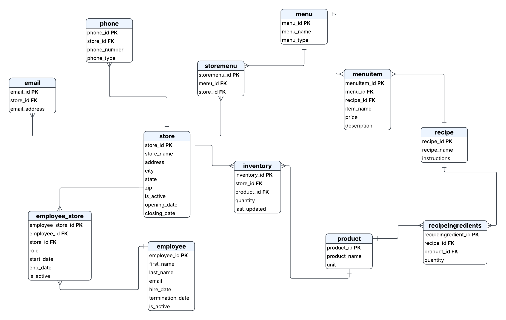

# MWC3 2026 — Franchise Restaurant Database Design

> 🥇 **1st Place** — MWC3 2026 Collegiate Database Design Competition

This repository contains my winning solution to the MWC3 2026 collegiate database design competition. The competition provided a problem statement with a set of minimum requirements and left most design decisions open-ended. Judges awarded extra points for going beyond the minimum requirements, so I focused on building a realistic, well-normalized database system that reflects how a franchise restaurant chain would actually operate.

---

## Competition

- **Event:** MWC3 2026 Collegiate Database Design Competition
- **Place:** 1st
- **Category:** Database Design
- **Competition Page:** [MWC3 Main Page](https://mwc3.org/)
- **Results Page:** [MWC3 2026 Results](https://mwc3.org/history/2026/competition-results/)

---

## Problem Statement

The full reconstructed problem statement is available in [`problem-statement.md`](./problem-statement.md).

In short, the problem asked for a centralized database system for a franchise restaurant company that needed to manage its locations, employees, menus, recipes, and inventory across all stores.

---

## ERD

The entity-relationship diagram was designed in Lucidchart and represents the full schema in 3rd Normal Form (3NF) using crow's foot notation.



---

## Folder Structure

```
MWC3-database-design/
├── README.md
├── problem-statement.md
├── design-decisions.md
├── results_MWC3_2026.png
└── terminology_database.md
└── databasedesign/
    ├── ERD.png
    ├── schema_sqlserver.sql
    ├── schema_standard.sql
    ├── index_sqlserver.sql
    ├── insert_sqlserver.sql
    └── update_sqlserver.sql
```

---

## Files

| File | Description |
|---|---|
| `problem-statement.md` | Reconstructed competition problem statement |
| `design-decisions.md` | Full justification for every design decision made |
| `results_MWC3_2026.png` | Screenshot of the official competition results |
| `terminology_database.md` | Database terminology + summary of concepts, to study or look later on |
| `databasedesign/ERD.png` | Entity-relationship diagram in crow's foot notation |
| `databasedesign/schema_sqlserver.sql` | DDL script to create all tables — SQL Server |
| `databasedesign/schema_standard.sql` | DDL script to create all tables — Standard SQL (ANSI) |
| `databasedesign/index_sqlserver.sql` | Index creation script with justification comments |
| `databasedesign/insert_sqlserver.sql` | Sample INSERT statements with realistic data |
| `databasedesign/update_sqlserver.sql` | Sample UPDATE statements covering all tables |

---

## Schema Overview

The database consists of 12 tables across three main areas:

**Store & Contact Info**
| Table | Description |
|---|---|
| `store` | Franchise restaurant locations |
| `email` | One or more email addresses per store |
| `phone` | One or more phone numbers per store |

**Workforce**
| Table | Description |
|---|---|
| `employee` | All employees across the franchise |
| `employee_store` | Many-to-many assignment of employees to stores with role and dates |

**Menu & Recipes**
| Table | Description |
|---|---|
| `menu` | Named menus such as breakfast, lunch, dinner |
| `storemenu` | Many-to-many assignment of menus to store locations |
| `menuitem` | Individual items listed on a menu, bridges menu and recipe, carries price |
| `recipe` | Recipe definitions with instructions |
| `recipeingredients` | Many-to-many bridge between recipe and product, carries quantity |

**Inventory**
| Table | Description |
|---|---|
| `product` | Ingredients and stock items used across the franchise |
| `inventory` | Per-store stock levels, bridges store and product, carries quantity |

---

## Design Highlights

A few decisions worth calling out. The full reasoning for every decision is in [`design-decisions.md`](./design-decisions.md).

**Menu Item as an associative entity**
`menuitem` is not just a list of dishes — it bridges `menu` and `recipe` and carries `price` and `description`. This means the same recipe can appear on multiple menus at different price points, which is realistic for a franchise that shares recipes across breakfast, lunch, and dinner menus.

**Employee to store is many-to-many**
In a franchise context, managers and supervisors often oversee multiple locations. The `employee_store` table handles this with `role`, `start_date`, `end_date`, and `is_active` per assignment, not just per employee.

**Inventory chain supports auto-decrement**
The chain `inventory → product → recipeingredients → recipe` means inventory can be automatically decremented when a recipe is prepared. This was not implemented as a trigger in this deliverable but the schema fully supports it.

**is_active and business dates over hard deletes**
Stores and employees are never hard deleted. Instead `is_active` is used for fast filtering and dedicated date columns (`opening_date`, `closing_date`, `hire_date`, `termination_date`) capture real business events separately from system timestamps.

---

## How to Run

Run the SQL Server scripts in this order:

```
1. schema_sqlserver.sql    -- creates all tables
2. index_sqlserver.sql     -- creates indexes
3. insert_sqlserver.sql    -- inserts sample data
4. update_sqlserver.sql    -- runs sample updates
```

Tested on Microsoft SQL Server. The `schema_standard.sql` file is an ANSI SQL version compatible with PostgreSQL and other standard-compliant databases.

---

## Tools Used

- **Lucidchart** — ERD design
- **Microsoft SQL Server** — target database engine
- **VS Code** — SQL authoring